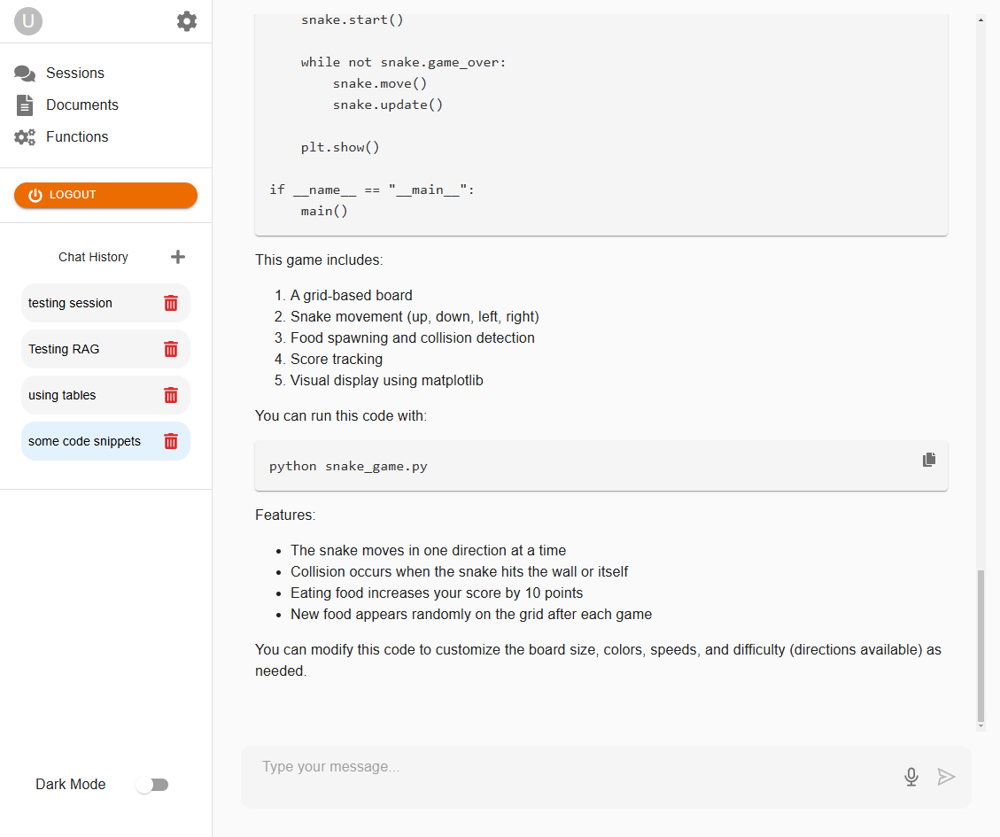

# Nov.AI (in Development)

Nov.AI is a **local** RAG (Retrieval Augmented Generation) system built with FastAPI (Python), leveraging partially `llamaindex` and `ollama` to run a local Large Language Model (deepseek-r1:1.5b). It also features:
- JWT-based authentication (user registration & login).
- Multi-session chat with persistent memory.
- Document management (upload, attach, remove).
- RAG-based retrieval from a local Chroma database (using manual chunking/embedding).
- (Planned) Function calling/tools system.

## Table of Contents
1. [Project Status](#project-status)
2. [Features](#features)
3. [Project Structure](#project-structure)
4. [RAG Implementation Details & LlamaIndex](#rag-implementation--llamaindex)
5. [Installation & Setup](#installation--setup)
6. [Running the Project](#running-the-project)
7. [Backend Endpoints Overview](#backend-endpoints-overview)
8. [Frontend](#frontend)
9. [Screenshots](#screenshots)

---

## Project Status

- **In Development**  
  - The system runs locally with `ollama` on port `11434`.
  - **Accomplished**:
    - Chain-of-thought (CoT) model running locally.
    - RAG with persistent ChromaDB storage.
    - Security layer (JWT-based).
    - Document management (upload, attach/detach).
    - Session management (multiple chat sessions, persistent conversations).
  - **In Progress**:
    - More granular message management inside each session (edit, update, remove).
    - Function calling implementation (currently dummy).
  - **Missing/Planned Improvements**:
    - Better error handling in streaming (currently requires page refresh to show error).
    - Blocking UI during document upload until the backend responds.
    - Auto-refresh when sessions expire, so UI updates without manual reload.
---

## RAG Implementation & LlamaIndex

Originally planned to let LlamaIndex handle all the chunking, embedding, and retrieval for a typical RAG setup. However, due to the complexity of requirements—multiple user sessions, documents that can be attached/detached at runtime, plus a persistent SQL-based & persistent vector-storage document manager, opted for a more manual approach:

- **Manual Chunking & Embedding**: Split each uploaded document into chunks and embed them with a HuggingFace model. These chunks/embeddings are then stored in a local Chroma database.
- **Selective Retrieval**: During chat inference, if a user’s session has documents attached, only query the subset of chunks whose `doc_id` is in the session’s attached list.
- **LlamaIndex Usage**: Still rely on LlamaIndex for:
  - The Ollama integration, which lets stream local LLM responses (our `LLMService`).
  - The HuggingFace embedding model class (`HuggingFaceEmbedding`) for generating embeddings.
  - The message memory system.
  
By handling chunking and storage without llamaindex,attach or detach documents per session is more direct. This does limit some of LlamaIndex’s built-in features like dynamic re-chunking, rewriting, and hierarchical indexes. In future projects, leverage LlamaIndex’s full indexing pipeline for a simpler end-to-end RAG solution will be considered.

## RAG Debug Endpoints

Exposed an internal set of routes under `/rag/` purely for **debugging and research**. These endpoints let inspect exactly how storing and retrieving text chunks/embeddings in is stored in Chroma. Not intended for production use!

---

## Features
1. **User System**  
   - Registration & login using JWT tokens.  
   - Basic session expiration/renewal flow.

2. **Chat & Memory**  
   - Users can create multiple **chat sessions**.
   - Each session stores chat messages (user & assistant).
   - Messages are saved in a local database, so they persist across restarts.

3. **Documents (RAG)**  
   - Users can upload documents.
   - Documents can be attached/detached from any chat session.
   - RAG is integrated via a local Chroma database.
   - Documents are chunked and embedded upon upload, and then retrieved during inference.

4. **Tools (Function Calling)**  
   - Basic structure to load available tools (e.g., Weather, Internet, etc.) Dummy for now.
   - Tools can be attached/detached to sessions (symbolic for now).

5. **Local LLM**  
   - Powered by `llamaindex` + `ollama` for local inference.  
   - Uses an open-source CoT (chain-of-thought) model: **deepseek-r1:1.5b**.

6. **Frontend**  
   - Streams tokens in real-time, including *thinking* content.  
   - Supports Markdown, tables, code snippet blocks, and a responsive UI.  
   - Implements add/remove/list for sessions, documents, and (static) function tools.

---

## Project Structure

**Main directories and files**:

   - main.py <-- FastAPI entry point
   - config.py <-- Configuration parameters
   - security.py <-- JWT token creation/verification
   - database.py <-- SQLAlchemy engine & session
   - rag/ <-- RAG system (database modificarion, query, etc.)
   - models/ <-- Database models (User, Session, Documents, etc.)
   - routes/ <-- FastAPI route definitions (auth, chat, sessions, tools, documents)
   - services/ <-- Core logic: chat_service, memory_service, LLM service, RAG service
   - utils/logger.py <-- Central logger setup
   - create_tables.py <-- Utility script to initialize DB schema
   - seed_tools.py <-- (Optional) Template for seeding function-calling tools

---

## Installation & Setup

**Prerequisites**:
- Python 3.9+ (recommend using Conda environment).
- `ollama` installed and running locally (on default port 11434).

**1) Create and activate a Conda environment** (example command):
```bash
conda create -n novai python=3.9
conda activate novai
```

**2) Install required Python packages**:
```bash
pip install fastapi uvicorn sqlalchemy pydantic python-jose llamaindex ...
```

*(Check the `requirements.txt` or your internal reference for the complete list.)*

**3) Initialize the database**:
```bash
python create_tables.py
```

This creates the necessary tables in the local `database.db`.

**4) (Optional) Seed Tools**:
```bash
python seed_tools.py
```

This inserts some sample dummy tools for the function-calling demonstration.

---

## Running the Project

**1) Start 'ollama'** (in a separate terminal/window) to serve the local model:
```bash
ollama serve
```

**2) Launch the FastAPI backend**:
```bash
uvicorn main:app --reload --host 0.0.0.0 --port 8000
```

**3) Access the API**:  
Default backend URL: `http://localhost:8000/`

---

## Backend Endpoints Overview

1. **Authentication (``/auth``)**  
   - ``POST /auth/register``  
   - ``POST /auth/login``  
   - ``POST /auth/logout``  
   - ``GET /auth/profile``  

2. **Chat (``/chat``)**  
   - ``POST /chat/stream`` (streams inference tokens)  
   - ``POST /chat/stop`` (stops ongoing inference)

3. **Sessions (``/sessions``)**  
   - ``GET /sessions`` (list user sessions)  
   - ``POST /sessions`` (create session)  
   - ``DELETE /sessions/{session_id}`` (delete session)  
   - ``GET /sessions/{session_id}/messages`` (list messages)  
   - ``POST /sessions/{session_id}/messages`` (add new message)  
   - ``PUT /sessions/{session_id}/messages/{message_id}`` (edit message)  
   - ``DELETE /sessions/{session_id}/messages/{message_id}`` (remove message)

4. **Documents (``/documents``)**  
   - ``GET /documents/list`` (list user documents)  
   - ``POST /documents/upload`` (upload and ingest doc)  
   - ``POST /documents/delete`` (delete a document)  
   - ``POST /documents/attach`` (attach doc to session)  
   - ``POST /documents/detach`` (detach doc from session)

5. **Tools (``/tools``)**  
   - ``GET /tools/list`` (lists all available tools)  
   - ``POST /tools/attach`` (attach a tool to a session)  
   - ``POST /tools/detach`` (detach a tool from a session)

---

## Frontend

**Technologies**:  
- Built with React, Vite, and MUI.

**Running**:
```bash
cd frontend
npm install
npm run dev
```

The frontend is configured to talk to ``http://localhost:8000`` by default (adjust if needed).

---

## Screenshots

**Register / Log In**


**Chat / Inference**


**Chat / Inference - Light theme**





**Sessions Manager**


**Managers**


---

**Enjoy experimenting with Nov.AI!**  
Feel free to explore the code and modify it to suit your research and development needs.